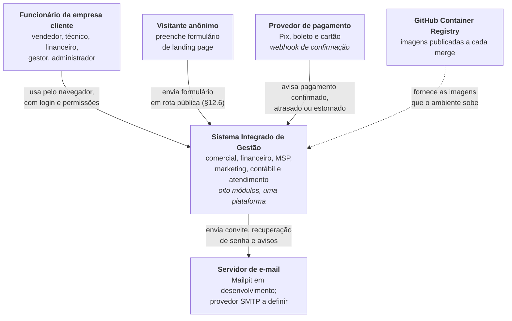
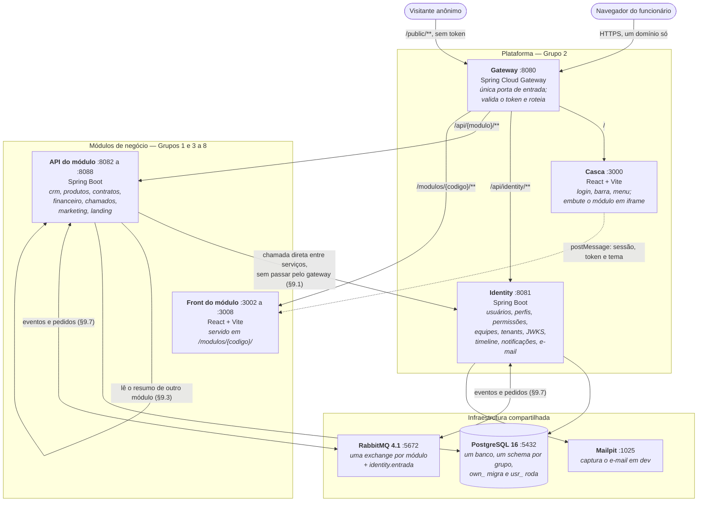
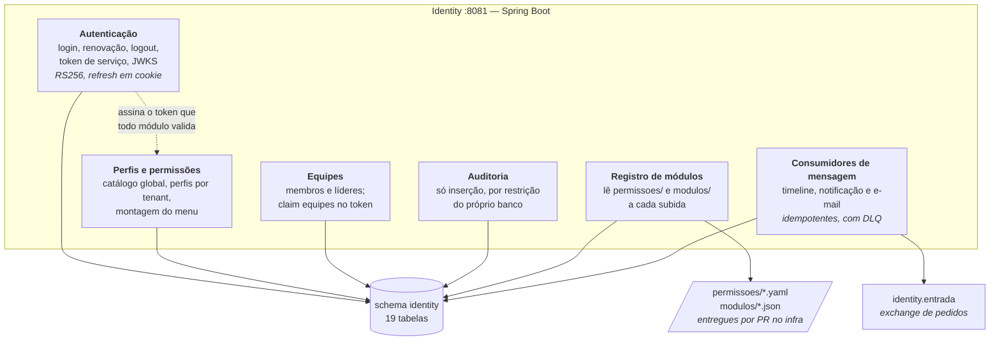

# Diagramas C4 — Sistema Integrado de Gestão

> Projeto Integrador 2026 · Grupo 2 — Plataforma e Controle de Usuários
> Etapa **Arquitetura da solução (Documentação)** da matriz de acompanhamento
> Versão 1.0 · 25 de setembro de 2026

O modelo C4 descreve a arquitetura em níveis, do mais amplo ao mais detalhado. Aqui estão os
três primeiros: **contexto**, **contêineres** e **componentes**. O quarto nível, de código, não
é mantido como desenho — ele vive nos contratos OpenAPI e no próprio código.

As regras citadas por `§` são do [Contrato de Integração dos Módulos v0.7](https://github.com/karolAlbuquerque/infra-integrador-2026/blob/main/docs/contrato-de-integracao.md),
que está em vigor para os oito grupos.

---

## Nível 1 — Contexto

Quem usa o sistema e com que outros sistemas ele fala.

**Fronteira do sistema.** Tudo o que os oito grupos constroem está dentro do retângulo central.
O que está fora são serviços de terceiros: e-mail, meio de pagamento e o registro de imagens.
Redes sociais, telefonia e WhatsApp ficaram fora do escopo do semestre.

---

## Nível 2 — Contêineres

Cada caixa é algo que roda sozinho: um serviço, um front ou uma peça de infraestrutura.
As portas são fixas (§13.3), para um `docker compose up` subir o sistema inteiro sem conflito.

**Três decisões que o desenho mostra:**

1. **O navegador conhece um endereço só.** Casca, fronts e APIs saem do mesmo domínio, separados
   por caminho (§12.8). Isso elimina CORS, deixa o cookie do refresh token funcionar sem
   configuração e faz a verificação de origem do iframe comparar com um valor único.
2. **Serviço fala com serviço direto**, pelo nome do contêiner. O gateway existe para o tráfego
   que entra; se o tráfego interno passasse por ele, viraria ponto único de falha (§9.1).
3. **O banco é um só, com um schema por grupo e dois usuários por schema** (§7.1). Nenhum módulo
   consegue ler o schema do outro — é restrição do banco, não combinado. A única leitura cruzada
   permitida é em *view* pública `vw_pub_*`, para relatórios (§9.8).

---

## Nível 3 — Componentes do Identity

Detalhe do contêiner que o Grupo 2 implementa. Os demais grupos desenham o seu da mesma forma.

**Por que o registro de módulos é um componente e não uma tabela escrita à mão:** a plataforma não
conhece nenhum módulo pelo código-fonte. Ela lê, a cada subida, os arquivos que cada grupo entrega
por pull request e monta o menu a partir deles (§11). Um grupo novo entra no sistema sem o Grupo 2
recompilar nada.

---

## Como estes diagramas se mantêm vivos

| Nível | Muda quando | Onde conferir |
|---|---|---|
| Contexto | entra ou sai um ator ou sistema externo | Mapa de Fronteiras |
| Contêineres | entra um módulo, muda porta ou peça de infraestrutura | Contrato §13.3 e `docker-compose.yml` |
| Componentes | muda a divisão interna do identity | código do `identity` e Requisitos da Plataforma |

Os diagramas estão em Mermaid, dentro do repositório, e não como imagem: assim a alteração
aparece no *diff* do pull request, como qualquer outra mudança de contrato.
